# Установка

1. Регистрация на https://cloud.google.com/
2. Получения ключа Google Vision API
3. Создание файла private_key.py, где private_secret_key="ВАШ КЛЮЧ"
4. Установка всех библиотек 
    > pip install -r requirements.txt
5. Загрузка the-best-extention в Google Chrome
6. Запуск
    > python3 app.py

** Вся информация о проекте находится [тут](https://drive.google.com/drive/folders/18DAkf45O00Y1OQekZLbQ9DdD4bnLIzhw?lfhs=2)**

**Государственное бюджетное общеобразовательное**

**учреждение города Москвы \"Школа № 1535\"**

**"Terly. Расширение для браузера, способное распознавать рукописный
текст по фотографиям"**

> **Выполнили:**
>
> **Щербаков Алексей**
>
> **Юнда Степан**
>
> **ГБОУ «Школа 1535», 10В класс**
>
> **Научный руководитель:**
>
> **Жемчужников Д.Г., к.п.н.,**
>
> **учитель информатики**

**Москва 2022**

# Введение

Год назад, когда все школы были переведены на дистанционный формат
обучения, учителям приходилось проверять много домашних работ,
отправленных учениками в виде фотографий. Они были вынуждены часами
вглядываться в монитор компьютера, в ужасный почерк учеников. Это
подвергало зрение учителей опасности, вызывало усталость и головные
боли. Сложнее всего приходилось учителям, ведущим гуманитарные предметы,
ведь количество фотографий от каждого учащегося превышало 3 шт. Конечно,
ничто не мешает ученикам отправлять домашнее задания в виде файла с
напечатанным на компьютере текстом. Но большинство учителей было против,
ссылаясь на известную пословицу: "Что написано пером, не вырубишь
топором".

# Актуальность

Рассмотрен новый способ взаимодействия учеников и учителей, который
избавляет учителей от долгого разбора текста, написанного учениками.
Преподаватели смогут быстрее проверять работы, присланные учениками. Это
позволит выделять больше времени для подготовки к уроку.

Посредством специального расширения для браузера Google Chrome учителя
смогут в два клика получить готовый "печатный" текст, который гораздо
легче воспринимать.

К сожалению, сегодня нет большой базы данных (далее - БД) русского
почерка, достаточной для высокой точности распознавания. Поэтому каждая
фотография будет разбиваться на слова и отправляться в БД сайта; в
дальнейшем используемый "искусственный интеллект" будет развиваться и,
наконец, дойдёт до того уровня, когда сможет понимать почерк учеников
лучше, чем это делают сами учителя.

Коронавирусная инфекция COVID-19 распространяется волнами, которые почти
невозможно предугадать, что ставит вопрос о возможности повторного
введения дистанционного формата обучения. Если снова возникнет такая
ситуация, то, на этот раз, у учителей будет на вооружении мощный
инструмент для быстрой и удобной проверки работ.

# Новизна и анализ рынка

Первичный анализ рынка [2] и поиск аналогов в сети интернет показал,
что не существует сайтов или расширений для браузеров, способных
перевести русский рукописный текст с фотографии в машинный.

Что касается приложений для ПК или для мобильных ОС, существуют только
два ведущих приложения, функционал которых значительно превосходит
аналоги. Это ABBYY Finereader Engine и Google Lens.

Для учителя использование приложений для ПК или смартфона изначально
создает определенные неудобства. Ученик чаще всего отправляет задания на
почту в виде файлов, или прикрепляет изображения в такие веб-приложения,
как Google Classroom. Соответственно учителю необходимо скачать
фотографии на компьютер, чтобы распознать текст. В масштабах класса
количество фотографий может превысить сотню.

1.  **Google Lens**

Приложение Google Lens создано для смартфонов Android \\ IOS, позволяет
с высокой точностью распознавать русский рукописный текст. Чтобы
воспользоваться приложением, необходимо сделать фотографию текста, что
занимает много времени.

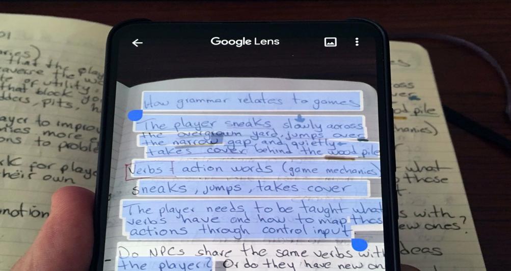

> Рисунок 1. Результат работы приложения Google Lens

2.  **ABBYY FineReader Engine**

Этот OCR SDK на базе искусственного интеллекта (рис. 2) представляет
функции распознавания текста, преобразования PDF и захвата данных,
позволяя преобразовывать отсканированные изображения в доступные для
поиска документы, а также получать доступ к данным на изображениях.
ABBYY FineReader Engine обладает самой высокой точностью на рынке.

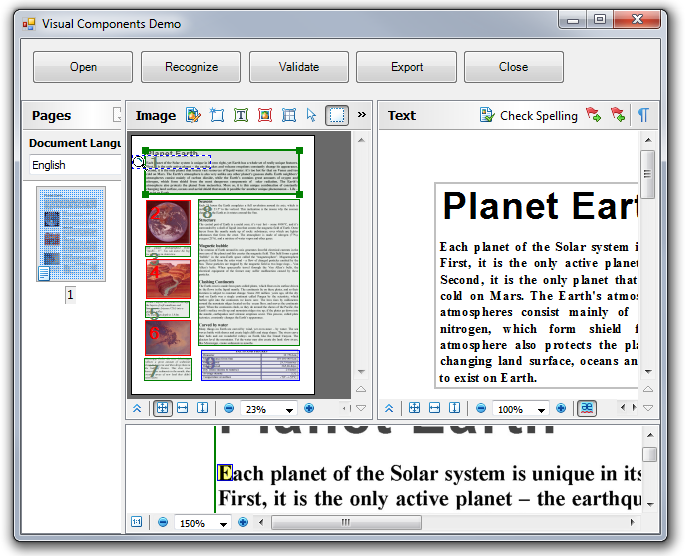

> Рисунок 2. Результат работы приложения ABBYY FineReader Engine.

# Цели и задачи проекта

## Проблема

Отсутствие на рынке инструмента для браузера, способного в несколько
кликов распознавать изображения с рукописным текстом. Особенно актуально
для преподавателей.

## Цель проекта

Создать удобное расширение для браузера с минимальным и дружественным
интерфейсом, которое будет помогать учителям быстро проверять рукописные
работы обучающихся.

## Задачи проекта

1.  Изучить основы JavaScript, Python, Flask

2.  Создать расширение (сайт)

3.  Создать и обучить нейронную сеть, способную определять слова на
    фотографии

4.  Создать удобный интерфейс

5.  Протестировать расширение

6.  Разместить сайт и расширение в сети интернет, в интернет-магазине
    расширений Chrome

7.  Апробировать расширение среди учителей

8.  Отладить и доработать код, получив обратную связь

# План проекта

Подробный план находится в [[Приложении
6]](https://docs.google.com/document/u/0/d/1GEiswKjpfDHGbBg8Ah1A6hxMV8KOl-6L8lPDEnEk5ys/edit).

# Ресурсы

-   Подключение к сети Интернет (\~ 500 руб. / мес.)

-   Компьютерное и проприетарное ПО - база проекта

-   Графический ускоритель NVIDIA GEFORCE RTX 2060 SUPER (использовалась
    для быстрого обучения нейронной сети) - из личного пользования

-   Рабочее и личное время разработчиков - 90 часов

-   Рабочее и личное время научного руководителя - 7 часов

# Проектирование

## Описание работы приложения

Порядок работы в приложения можно разбить на три этапа:

1)  Ученик отправляет свое домашнее задание на почту (или в LMS)

2)  Учитель открывает изображение в браузере, выбирает в контекстном
    меню расширение Terly (рис. 3)

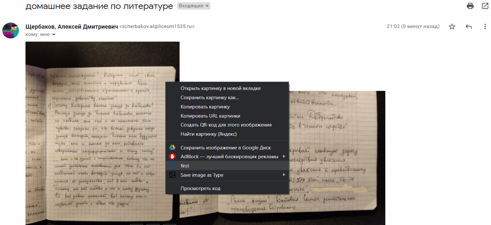
> Рис. 3. Изображение работы приложения

3)  На сайте Terly распознается рукописный текст и происходит перевод
    его в печатный. На рис. 4 показан результат работы приложения.
Для достижения поставленной цели необходимо разработать веб-расширение
для браузера Google Chrome.

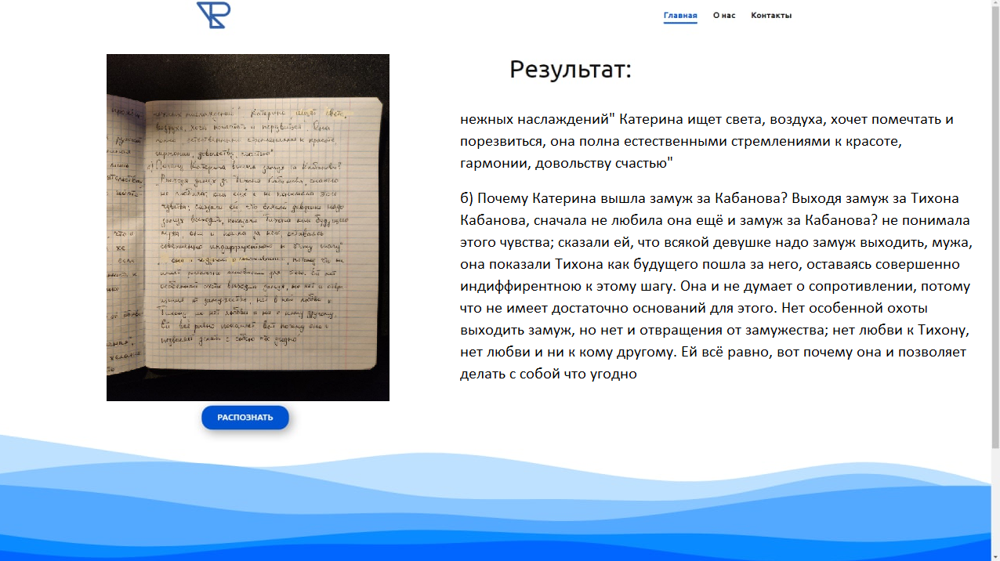

> Рисунок 4. Результат работы приложения

## Разработка оформления сайта

Было решено начать с графического оформления сайта (фронтенда). Задача
состоит в том, чтобы сделать интерфейс простым, интуитивно понятным и не
отвлекающим внимания (см. рис. 4). Подробнее см. в [[приложении
7]](https://docs.google.com/document/u/0/d/1GEiswKjpfDHGbBg8Ah1A6hxMV8KOl-6L8lPDEnEk5ys/edit).

## Разработка расширения для Google Chrome

Чтобы максимально упростить передачу картинки с LMS на наш сайт, мы
будем разрабатывать расширение для Google Chrome. Для его создания нам
требуются 3 файла.

-   manifest.json --- требуемая браузером информация о расширении

-   eventPage.js --- сам скрипт, передающий изображение на сайт

-   popup.html --- краткая информация о расширении

Подробнее см. в [[приложении
1]](https://docs.google.com/document/u/0/d/1GEiswKjpfDHGbBg8Ah1A6hxMV8KOl-6L8lPDEnEk5ys/edit).

## Серверная часть

В данной части проекта необходимо реализовать следующие важные элементы
расширения:

-   "Искусственный интеллект"

-   Готовое решение от Google Vision API, чтобы повысить точность
    распознавания

-   Расширение для браузера

-   Сервер на фреймворке Flask

-   Система обнаружения отдельных слов и последующей их записи в БД

-   Алгоритмы предобработки изображений

5.  **Регистрация в Google Vision API**

Было решено начать с регистрации в Google Vision API (рис. 5).

C помощью API удалось получить некоторые результаты, которые далеки от
идеала (рис. 6).

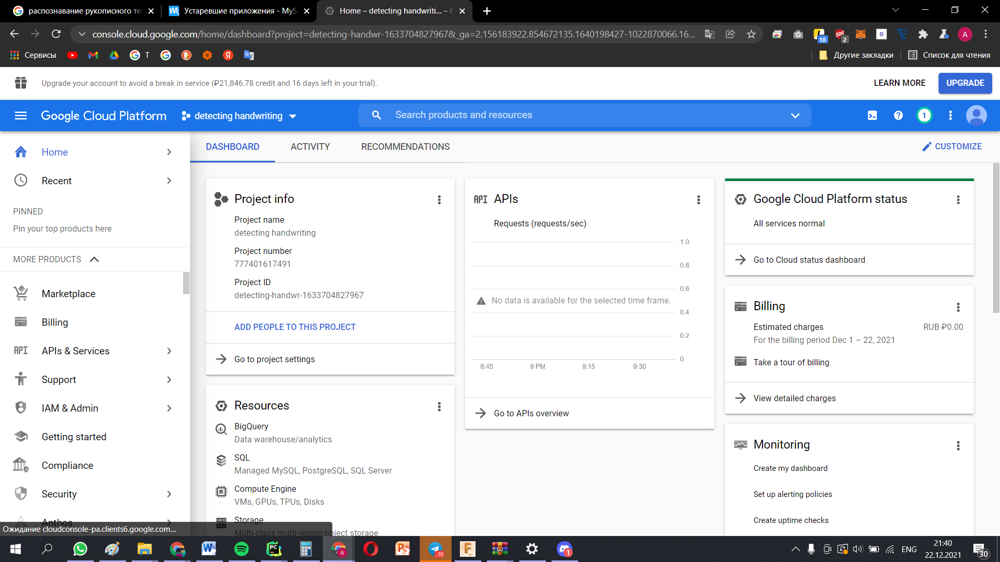

> Рисунок 5. Google console

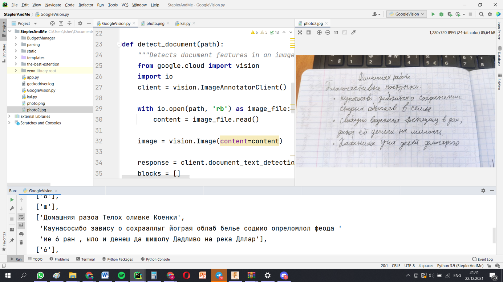

> Рисунок 6. Результаты Google Vision

6.  **Разработка искусственного интеллекта**

Приступаем к разработке своего "искусственного интеллекта". Необходима
БД.

В публичном доступе отсутствуют размеченные наборы данных на русском
языке. Доступные данные либо описывают английский текст, либо недоступны
для коммерческого использования. В качестве теста, исследования, была
взята самая большая БД из найденных. Подробнее см. в [приложении 2](https://docs.google.com/document/u/0/d/1GEiswKjpfDHGbBg8Ah1A6hxMV8KOl-6L8lPDEnEk5ys/edit)

Рисунок 7. Пример слов из HKR

БД обладает недостатками, которые будут мешать обучению нейросети:

-   Многие изображения не центрированы, остаются белые края, что будет
    сбивать нейросеть

-   Слова написаны ручками разных цветов, необходимо привести к единому
    цвету и стандарту

-   Хотя в БД большое количество слов (\~60 тысяч), такого количества
    все равно недостаточно (для английского языка существуют БД с
    гораздо большим количеством слов \[13\] - 115 тысяч неповторяющийся
    слов)

Исходя из вышеперечисленных недостатков, необходима предобработка
данных. Ее этапы описаны в [[приложении
3]](https://docs.google.com/document/u/0/d/1GEiswKjpfDHGbBg8Ah1A6hxMV8KOl-6L8lPDEnEk5ys/edit):

Разрабатываем нейросеть (рис. 8).

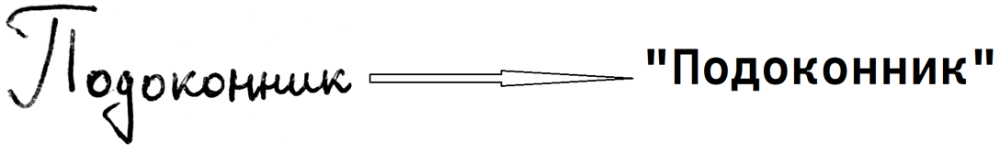

> Рисунок 8. Пример работы нейросети

Используем небольшую нейронную сеть для нашей задачи. Она состоит из
слоев CNN, RNN и слоя CTC (рис. 9).

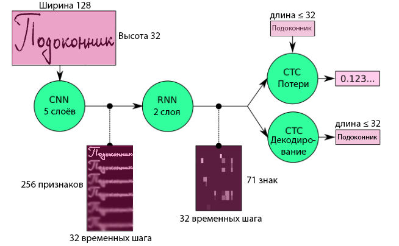

> Рисунок 9. Схема нейросети

На вход подается изображение в серых тонах, затем приводится к размеру
128×32 - уменьшаем размер, сохраняя пропорции, пока не достигнем одного
из этих измерений.

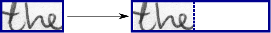

> Рисунок 10. Изменение размера изображения

Второй слой - это слой активации ReLu (выпрямленная линейная единица).
График представлен на рис. 11.

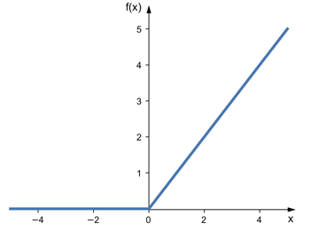

> Рисунок 11. Функция активации ReLu.

На этом этапе применяется функция выпрямления для увеличения
нелинейности в CNN, так как изображения состоят из разных объектов,
которые не являются линейными относительно друг друга.

Необходимость использования слоев активации более подробно объясняется в
книге [8].

На рис. 16 показаны выходные данные слоев CNN, которые представляют
собой последовательность длиной 32. Каждая запись содержит 256
признаков. Эти признаки в дальнейшем обрабатываются слоями RNN, однако
некоторые признаки уже показывают высокую корреляцию с высокоуровневыми
свойствами входного изображения:

​​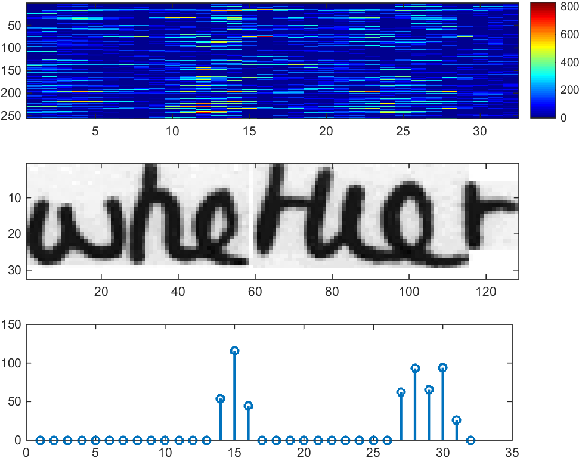

> Рисунок 12. Выходные данные слоев CNN.

Далее следует слой RNN. Это последовательность функций содержит 256
возможных значений на временной шаг - "полосы, на которые разбивается
изображение"; всего временных шагов - 32. Подробнее см. в [[приложении
5]](https://docs.google.com/document/u/0/d/1GEiswKjpfDHGbBg8Ah1A6hxMV8KOl-6L8lPDEnEk5ys/edit).

7.  **Обучение нейросети**

Первоначально были проведены 3 цикла обучения, используя разные
последние слои CTC (bestpath, beamsearch, wordbeamsearch), в каждом из
которых было по 100 эпох; данные разбивались на 122 батча (группы), в
каждом из которых было по 500 пар изображение - расшифровка. Обучение
проводилось с помощью библиотеки Tensorflow 2.0, драйверов CUDA 11.6,
видеокарты NVIDIA 2060 SUPER.

> Таблица 3. Результаты обучения нейросети

| Алгоритм       | CER (char error rate) доля ошибок в буквенном распознавании | WAR (word accuracy rate) точность распознавании слов цели |
|----------------|-------------------------------------------------------------|-----------------------------------------------------------|
| bestpath       | 0.435                                                       | 0.63                                                      |
| beamsearch     | 0.41                                                        | 0.68                                                      |
| wordbeamsearch | 0.36                                                        | 0.75                                                      |

Как мы видим, нейросеть показывает лучшие результаты, когда
используется алгоритм wordbeamsearch, что не удивительно, так как он
совершеннее других. Остановимся на последнем цикле подробнее (рис. 13
и рис. 14).

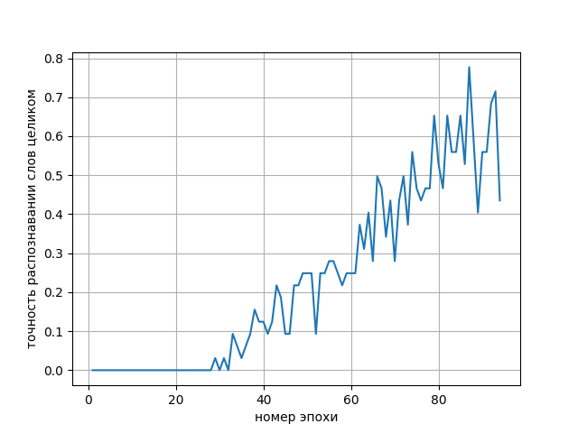

> Рисунок 13. Точность распознавания слов целиком

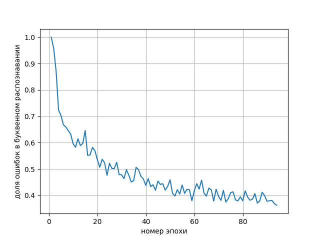

> Рисунок 14. Доля ошибок в буквенном распознавании

Приступим к анализу графиков. Первый с некоторого момента начинает
расти линейно, второй же убывает экспоненциально. Под конец обучения
точность распознавания слов начала увеличиваться намного быстрее, чем
точность распознавания отдельных букв. Это, в первую очередь, говорит
о том, что нейросеть начала переобучаться, подгоняя веса и смещения
под данную БД. Наше предположения также подтверждает следующий
эксперимент. Мы подготовили для нейросети два слова: «домовой» и
«атырау) (специально с прописной буквы!). В БД не было слова
"домовой", зато было слово "Атырау" (с заглавной буквы).

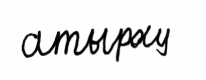

> Рисунок 15. "атырау" прописью

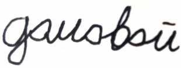

> Рисунок 16. "домовой" прописью

«Домовой» нейросеть распознала как "зиновой", "атырау" как "Атырау".
Из этого можно сделать вывод, что переобученная нейросеть распознает
только те слова, которые изначально были в БД.

Первый опыт в обучении (пусть даже и не очень удачный) помог нам
осознать наши ошибки и понять, что нам надо делать дальше. Мы решили
начать создавать свою БД, учитывая наши предыдущие ошибки и опыт
казахстанских коллег.

В качестве БД было выбрано 4200 самых часто употребляемых слов
русского языка, не короче 5 символов и не длиннее 12. В итоге
получилось 47 форм по 90 слов на каждой. Мы специально включили слова,
которые невозможно уместить в таком маленьком поле, чтобы человек
намеренно зачеркнул их, и нейросеть училась бы справляться с
исправлениями. Они были розданы родственникам, друзьям и
одноклассникам. Каждая форма имеет уникальный номер, который
определяет, какие слова на ней находятся (рис. 17). При сканировании
всех форм на одном принтере, заранее известно местоположение слов,
поэтому не придется работать с обнаружением слов. Однако 4 тысяч слов
никак не сравнимо с размером базы данных, на которой нейросеть
способна обучиться до хорошего уровня. В перспективе мы планируем ее
расширять; в качестве прототипа будет использоваться нейросеть,
обученная на HKR, а также Google Vision API.

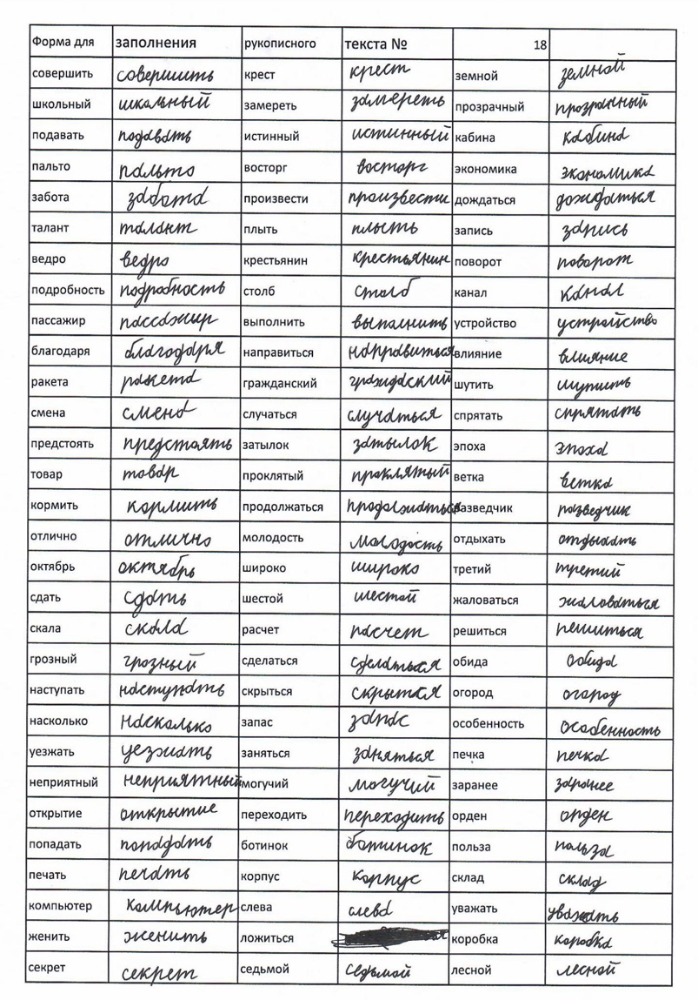

> Рисунок 17. Пример заполненной формы

## Back End сайта

Серверная часть сайта полностью написана на фреймворке flask.
Предобработка изображений необходима, т.к нейросеть сбивают тетрадные
"клеточки".
Будет использоваться Kernel фильтр библиотеки opencv2, а также
морфологическая операция.
Принцип работы продемонстрирован на рисунках 18 и 19.

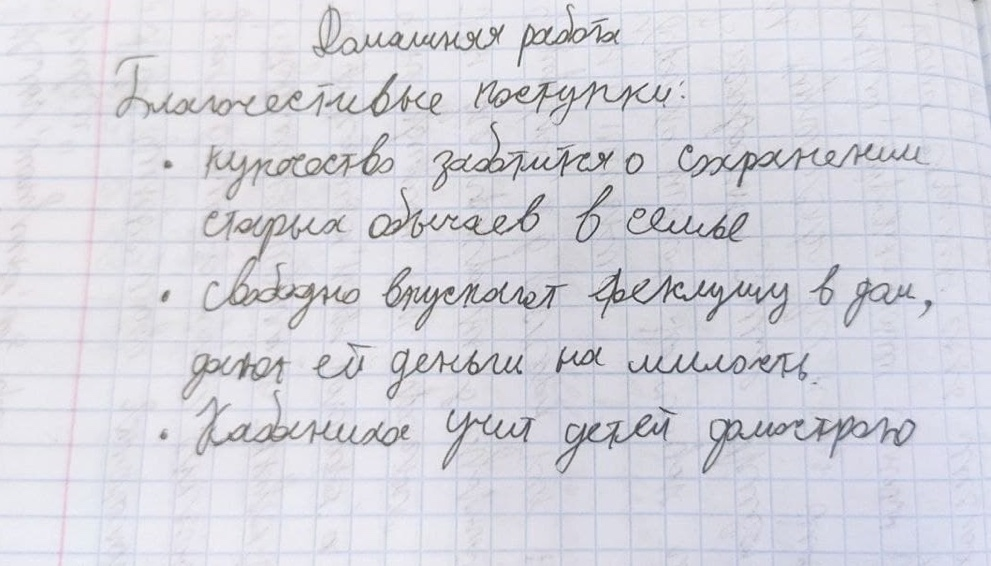

> Рисунок 18. Пример изображения

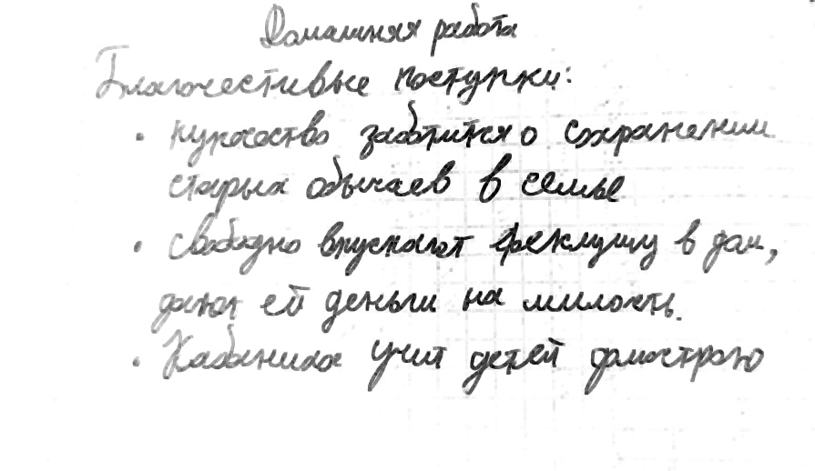

> Рисунок 19. Пример обработанного изображения

Фильтр осветляет и добавляет контраст изображению, помогая ИИ и
функции определения местоположения слов.

Чтобы отделить слова друг от друга, будет использоваться репозиторий
DeslantImg [1].

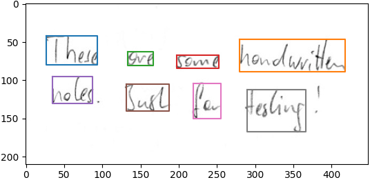

> Рисунок 20. Пример работы DeslantImg

# Результат, выводы и пути развития:

> Таблица 4. Сравнение с аналогами

  |                        | Google Lens | ABBYY FINEREADER | Terly     |
|------------------------|-------------|------------------|-----------|
| Удобство               | 9           | 4                | 10        |
| Веб-версия             | -           | -                | +         |
| Цена                   | бесплатно   | 200 $ / мес      | бесплатно |
| Языки (кол-во)         | Более двух  | Более двух       | 1         |
| Качество распознавания | 7           | 8                | 7         |
| Быстрота               | 9           | 3                | 10        |
| Итого                  | 27          | 17               | 29        |

1)  Разработано расширение для интернет-браузера Google Chrome,
    позволяющее распознать рукописный текст и преобразовать его в
    печатный.

2)  Поставленная цель достигнута, но не в том виде, в каком
    планировалось. Точность распознавания не идеальна:

-   у всех разный почерк, часто плохой;

-   не у всех хорошая камера: в этом случае выводятся рекомендации по
    улучшению качества снимка.

-   Отсутствие подходящей БД русской рукописи, из-за чего начали
    собирать свою (будет полезна разработчикам).

3)  В процессе работы над проектом были изучены:

-   Языки программирования JavaScript и HTML

-   фреймворк Flask

-   Базовые понятия о работе нейронных сетей.

4)  Разработан макет расширения для браузера Google Chrome. *Разработана
    нейронная сеть*, переводящая слова, обнаруженные на фотографии, в
    печатный текст.

5)  *Проведено тестирование расширения среди учителей* гуманитарных
    предметов. Расширение вызвало положительную реакцию, но были
    обнаружены и недочёты, которые мы исправили.

6)  Расширение *выложено в интернет-магазин расширений* Google Chrome,
    откуда его можно установить в браузер.

7)  Проект находится на стадии альфа-тестирования, то есть расширением
    можно пользоваться, но нередко бывают ошибки в распознавании слов.
    Не реализовано распознавание слов, написанных на английском языке.

8)  Несмотря на то, что мы столкнулись с трудностями, наш проект
    является очень перспективным. В будущем наша БД расширется до
    необходимого уровня, и станет самой большой БД рукописного русского
    языка, что может помочь реализации таких идей, как автоматическая
    проверка ЕГЭ и т.д.

# Пример работы расширения 

> Доступен по
> [ссылке](https://drive.google.com/file/d/1EdxNW4xggwWanYlBfR4uyHTq3V5delLe/view?usp=sharing)

# Список источников и использованной литературы

1) Алгоритм выравнивания курсивного почерка [Электронный ресурс]. --
    URL:
    [https://github.com/githubharald/DeslantImg](https://github.com/githubharald/DeslantImg)

2) Анализ поискового запроса [Электронный ресурс]. -- URL:
    [https://drive.google.com/file/d/1lp](https://drive.google.com/file/d/1lpXzj3x-zvfrIooUKciz-NW8iZr6OGOz/view)

3) Используемые книги:
   - Handwritten Text Recognition in Historical Documents [Электронный
       ресурс]. -- URL:
       [https://repositum.tuwien.at/retrieve/10807](https://repositum.tuwien.at/retrieve/10807)

   - An End-to-End Trainable Neural Network for Text Recognition
       [Электронный ресурс]. -- URL:
       [https://arxiv.org/abs/1507.05717](https://arxiv.org/abs/1507.05717)

   - Attention models for end-to-end handwritten paragraph recognition
       [Электронный ресурс]. -- URL:
       [http://www.tbluche.com/scan_attend_read.html](http://www.tbluche.com/scan_attend_read.html)

5) Реализация морфологической операции Google Chrome [Электронный
    ресурс]. URL:
    [https://github.com/PerryThePlatipuse/Terly/blob/](https://github.com/PerryThePlatipuse/Terly/blob/master/morphological%20operation/morph.py)

6) Реализация расширения Google Chrome [Электронный ресурс]. -- URL:
    [https://github.com/PerryThePlatipuse/Terly/tree/master/](https://github.com/PerryThePlatipuse/Terly/tree/master/the-best-extention)

7) Реализация Google Vision API [Электронный ресурс]. -- URL:
    ([https://github.com/PerryThePlatipuse/Terly/blob/master/](https://github.com/PerryThePlatipuse/Terly/blob/master/GoogleVision.py))

8) Формирование базы данных [Электронный ресурс]. -- URL:
    [https://fki.tic.heia-fr.ch/databases/iam-handwriting-database](https://fki.tic.heia-fr.ch/databases/iam-handwriting-database)

9) Deep Learning (Adaptive Computation and Machine Learning Series)
    [Электронный ресурс]. -- URL:
    https://www.amazon.com/Deep-Learning-Adaptive-Computation-Machine/dp/0262035618

10) Explanation of CTC [Электронный ресурс]. -- URL:
     [https://towardsdatascience.com/intuitively-under](https://towardsdatascience.com/intuitively-understanding-connectionist-temporal-classification-3797e43a86c)

11) FAQ: Handwritten Text Recognition System [Электронный ресурс]. --
    URL:
    [https://towardsdatascience.com/faq-build-a-handwritten](https://towardsdatascience.com/faq-build-a-handwritten-text-recognition-system-using-tensorflow-27648fb18519) -
    способы создания базы данных для обучения нейронной сети

12) Github: Handwritten Text Recognition [Электронный ресурс]. -- URL:
    [https://github.com/githubharald/SimpleHTR](https://github.com/githubharald/SimpleHTR) -
    еще одна реализация.

13) Handwritten Text Recognition System using TensorFlow [Электронный
    ресурс]. -- URL:
    [https://towardsdatascience.com/build-a-handwritten-text](https://towardsdatascience.com/build-a-handwritten-text-recognition-system-using-tensorflow-2326a3487cd5)

14) IAM dataset [Электронный ресурс]. -- URL:
    [https://fki.tic.heia-fr.ch/databases/iam-handwriting-database](https://fki.tic.heia-fr.ch/databases/iam-handwriting-database)

# Приложения

Доступны по
[ссылке](https://docs.google.com/document/d/1GEiswKjpfDHGbBg8Ah1A6hxMV8KOl-6L8lPDEnEk5ys/edit?usp=sharing)
